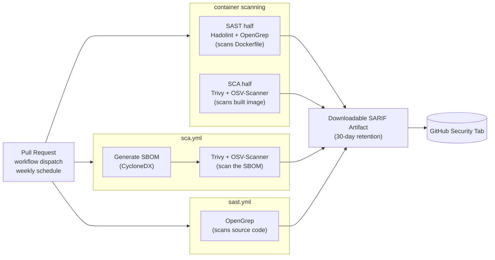

  
  
  

# EBRAINS DevSecOps Handbook

This handbook documents a working reference implementation of an OWASP
DevSecOps-aligned CI/CD security pipeline, built as a Google Summer of Code
2026 project for the EBRAINS community, using the **Medical Informatics
Platform (MIP)** as the proof of concept.

## Platform and maintenance notes

> **Status: active, in progress.** This handbook documents a Google Summer
> of Code 2026 project that is still under active development. Content
> reflects the pipelines as they exist today, not a finished, frozen
> product. Commands, thresholds, and file layouts may still change before
> the project ends. Where something is a decision still being discussed
> rather than a shipped fact, it is marked as such.

- Everything documented here has been built and tested on **Linux x86_64 /
  Ubuntu**, matching the `ubuntu-latest` GitHub Actions runner image. The
  install script (`setup-tools.sh`) is not portable as-is to macOS or
  native Windows. WSL2 works for Windows because it provides a real Linux
  userspace. There is currently no working path on native macOS.
- **Dockerizing the toolchain** (packaging the scanners into a container
  image published to GHCR, so the pipeline runs via `docker run` instead of
  the install script) is an idea under discussion with the project's docs
  mentor. It is **not a decided direction**. Do not treat any reference to
  it in this handbook as a shipped feature.
- Because the project is still active, some pages contain `TODO:` markers
  where the source material available at the time of writing did not cover
  something. Treat those as open gaps, not omissions.

## Table of Contents

- [README.md](README.md) (this file)
- [ABOUT-OWASP-CONTRIBUTION.md](ABOUT-OWASP-CONTRIBUTION.md)
- **tutorials/**
  - [01-setup-guide.md](tutorials/01-setup-guide.md)
- **how-to/**
  - [suppress-a-finding.md](how-to/suppress-a-finding.md)
  - [adjust-severity-gate.md](how-to/adjust-severity-gate.md)
  - [add-new-scanner.md](how-to/add-new-scanner.md)
  - [troubleshoot-maven-rate-limit.md](how-to/troubleshoot-maven-rate-limit.md)
  - [troubleshoot-sbom-generation-errors.md](how-to/troubleshoot-sbom-generation-errors.md)
- **reference/**
  - [pipeline-container-scanning.md](reference/pipeline-container-scanning.md)
  - [pipeline-sca.md](reference/pipeline-sca.md)
  - [pipeline-sast.md](reference/pipeline-sast.md)
  - [tool-installation-flags.md](reference/tool-installation-flags.md)
  - [exit-codes.md](reference/exit-codes.md)
  - [gate-status-cvss.md](reference/gate-status-cvss.md)
  - [gate-status-rule-severity.md](reference/gate-status-rule-severity.md)
- **explanation/**
  - [why-three-independent-pipelines.md](explanation/why-three-independent-pipelines.md)
  - [why-cvss-based-gating.md](explanation/why-cvss-based-gating.md)
  - [why-two-gate-models.md](explanation/why-two-gate-models.md)
  - [why-these-tools.md](explanation/why-these-tools.md)
  - [why-two-sca-tools.md](explanation/why-two-sca-tools.md)
  - [why-sboms.md](explanation/why-sboms.md)
  - [why-opengrep-not-semgrep.md](explanation/why-opengrep-not-semgrep.md)
- **case-studies/**
  - [platform-backend.md](case-studies/platform-backend.md)

## Why this exists

Security practices across EBRAINS and the wider Neuroinformatics community
currently vary from project to project, and in many cases only partially
meet the requirements of the Cyber Resilience Act (CRA) and NIS2. This
project starts from a maturity snapshot of MIP's pipelines, assessed against
the [OWASP DevSecOps Maturity Model (DSOMM)](https://dsomm.owasp.org/), and
turns that snapshot into an actionable, implemented set of controls, using
the [OWASP DevSecOps Guideline](https://github.com/OWASP/DevSecOpsGuideline)
as the implementation reference.

The outcome is a working reference pipeline that produces security
artifacts automatically (scan reports, SBOMs, gate decisions), reused across
three MIP components (`platform-backend`, `platform-ui`, and container
images), packaged here as a reusable secure-pipeline blueprint.

## What is actually implemented

Three independent GitHub Actions pipelines, each following the OWASP
DevSecOps model, each with its own workflow file, orchestrator script, and
gate:

| Pipeline | Scans | Tools |
|---|---|---|
| **Container Scanning** | The built Docker image + the Dockerfile itself | Trivy, OSV-Scanner (image CVEs); Hadolint, OpenGrep (Dockerfile SAST) |
| **SCA** (Software Composition Analysis) | Application dependencies, via a generated SBOM (CycloneDX) | Trivy, OSV-Scanner |
| **SAST** (Static Application Security Testing) | Application source code | OpenGrep |

See [reference/pipeline-container-scanning.md](reference/pipeline-container-scanning.md),
[reference/pipeline-sca.md](reference/pipeline-sca.md), and
[reference/pipeline-sast.md](reference/pipeline-sast.md) for the exact
commands, flags, and files involved in each.

### Architecture

Todo : I think this mermaid charts should be moved somewhere else 

All three workflows trigger independently and run in parallel; each
uploads its own SARIF category to the Security tab, see
[reference/exit-codes.md](reference/exit-codes.md) for the full category
list.

## How this handbook is organized

This handbook follows the [Diátaxis](https://diataxis.fr/) framework, the
same structure used by the official
[EBRAINS Handbook](https://handbook.ebrains.eu), so that migrating this
content there later, if that path is chosen, needs minimal rework:

- **tutorials/** - learning-oriented, step by step, works start to finish.
- **how-to/** - task-oriented, one job per file, assumes a working pipeline.
- **reference/** - information-oriented, tables and facts, no narrative.
- **explanation/** - understanding-oriented, the reasoning and tradeoffs
  behind the design.
- **case-studies/** - the one place real names, repo links, and
  project-specific detail are expected.

## Where to start

- New to this and want to set up the tools locally: start with
  [tutorials/01-setup-guide.md](tutorials/01-setup-guide.md).
- Already running the pipelines and need to do one specific thing (suppress
  a finding, add a scanner, adjust a gate): go to [how-to/](how-to/).
- Want exact commands, flags, exit codes, or gate thresholds: go to
  [reference/](reference/).
- Want to understand *why* the pipelines are built this way: go to
  [explanation/](explanation/).
- Want the concrete, named story of how this was built against
  `platform-backend`: read [case-studies/platform-backend.md](case-studies/platform-backend.md).

## Relationship to OWASP

This project has an open pull request against the upstream OWASP
DevSecOps Guideline. See
[ABOUT-OWASP-CONTRIBUTION.md](ABOUT-OWASP-CONTRIBUTION.md) for the full
history and the still-open question of whether this handbook stays tied to
the OWASP guide or becomes a standalone EBRAINS publication.
