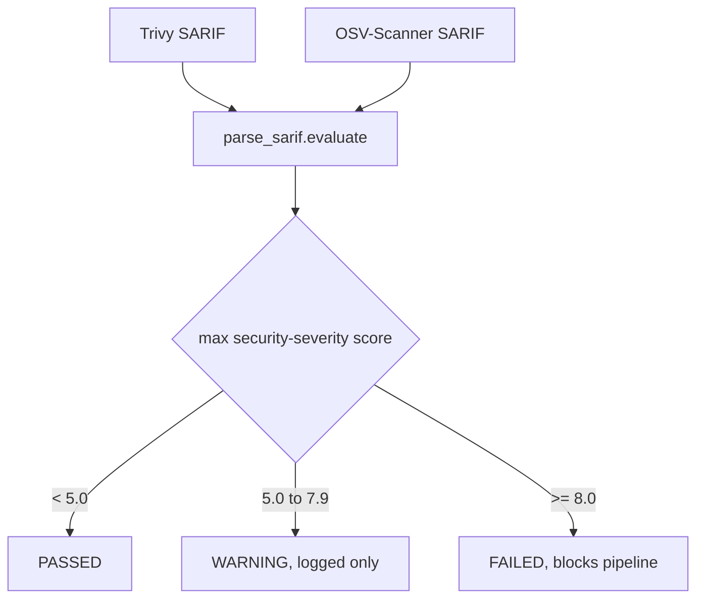

# Why CVSS-Based Gating for SCA, and a Custom SARIF Parser

## The core problem

Trivy and OSV-Scanner both produce SARIF output, and both can identify
vulnerabilities with CVSS severity scores. But they don't share the same
CLI flags for turning that score into a build pass/fail decision:

- Trivy makes it easy: `--severity CRITICAL` fails the build directly.
- OSV-Scanner has no equivalent simple flag for scoring-based failure.

Relying on each tool's native behavior would mean the two tools fail
builds according to two different, tool-specific rules, which makes gate
behavior inconsistent and hard to reason about across the pipeline.

## The decision

Rather than adding tool-specific gating logic per scanner, both tools'
SARIF output is read by one shared function, `parse_sarif.evaluate()`,
which looks at the `security-severity` property SARIF already carries
(both tools populate it) and applies one consistent threshold regardless
of which tool produced the finding.

This custom parsing step was a deliberate trade-off, weighed explicitly
against just avoiding custom parsers entirely. Both tools output SARIF
natively, and the general preference was to avoid maintaining custom
parsing logic, since a tool's output schema can change between versions
and that maintenance burden falls on this project. But no native flag
existed on the OSV-Scanner side to apply a CVSS threshold directly, so a
thin, shared SARIF-reading layer was chosen as the smaller maintenance
burden compared to two divergent per-tool gating paths.

## How the threshold values were arrived at

The specific numbers (fail at 8.0, warn from 5.0) went through more than
one iteration during design discussion:

- An early proposal used CRITICAL-only and CVSS >= 8.0 as the fail
  condition, with HIGH/MEDIUM and CVSS >= 5.0 as the warn condition.
- A separate discussion considered lowering the fail threshold to CVSS
  >= 7.0, to also fail on HIGH findings, not just CRITICAL-equivalent
  ones.
- The implementation that shipped in `parse_sarif.py` uses `>= 8.0` for
  `gate_failed` and `5.0 <= score < 8.0` for `gate_warn`.

For the standard CVSS severity band reference table, see
[gate-status-cvss.md](../reference/gate-status-cvss.md). Note that 8.0
falls inside the standard "HIGH" band (7.0-8.9), not at the CRITICAL
boundary (9.0), the project's fail line is intentionally a bit more
permissive than "any CRITICAL or above" would suggest, and stricter than
"only true CRITICAL scores" would suggest, it's a chosen compromise, not a
direct restatement of the standard bands.

## Why a missing SARIF file fails the gate

`parse_sarif.evaluate()` and the orchestrators around it treat a missing
or unparseable SARIF file as an `ERROR`, which blocks the pipeline, the
same as a `FAILED` gate. This is intentional: a missing report means the
tool did not actually run (crashed, misconfigured, wrong path), and
treating that silently as "no findings, so PASSED" would let a completely
broken scanner pass every build indefinitely without anyone noticing.

## Relation to the OWASP contribution

This same reasoning, normalizing gate checks across scanners that don't
share a native severity-based fail flag, is one of the two improvements
proposed in the upstream pull request to the OWASP DevSecOps Guideline,
[#107](https://github.com/OWASP/DevSecOpsGuideline/pull/107). See
[ABOUT-OWASP-CONTRIBUTION.md](../ABOUT-OWASP-CONTRIBUTION.md).
