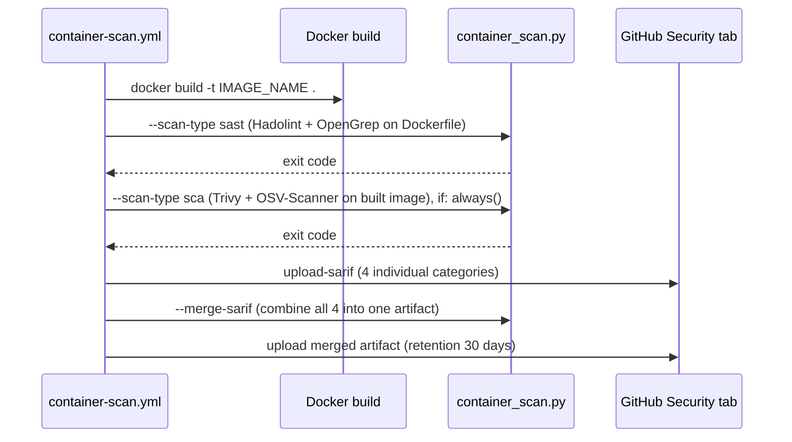

# Reference: Container Scanning Pipeline

| Property | Value |
|---|---|
| Workflow file | `container-scan.yml` |
| Orchestrator | `ci/container_scan.py` |
| Triggers | `pull_request`, `workflow_dispatch`, weekly schedule |
| Scans | The built Docker image, and the `Dockerfile` itself |
| SCA tools | Trivy, OSV-Scanner |
| SAST tools | OpenGrep |
| Linting tools| Hadolint |
| Gate model, image scan | CVSS-score gate (see [gate-status-cvss.md](gate-status-cvss.md)) |
| Gate model, Dockerfile scan | Rule-severity gate (see [gate-status-rule-severity.md](gate-status-rule-severity.md)) |

## Execution order



The SCA-type run executes with `if: always()`, so it still runs even if
the Dockerfile SAST step failed. This means a bad Dockerfile lint does not
prevent the image itself from being scanned for CVEs in the same job.

## CLI

`container_scan.py` is a single CLI shared by both scan types:

```
$ python3 ci/container_scan.py --help
usage: sec-orchestrator [-h] [-s {sast,sca}] [-i IMAGE] [--merge-sarif SARIF_FILE [SARIF_FILE ...]] [--merge-output MERGE_OUTPUT]

Agnostic DevSecOps Container scanning Pipeline Orchestrator

options:
  -h, --help            show this help message and exit
  -s, --scan-type {sast,sca}
                        Specify the security methodology to execute (e.g., sast, sca)
  -i, --image IMAGE     Target Docker image reference
  --merge-sarif SARIF_FILE [SARIF_FILE ...]
                        List of SARIF files to merge into one report
  --merge-output MERGE_OUTPUT
                        Output path for the merged SARIF file
```

## Environment variables

| Variable | Default | Purpose |
|---|---|---|
| `IMAGE_NAME` | `platform-ui:local` / `platform-backend:local` | Image reference passed to Trivy and OSV-Scanner |
| `TRIVY_IGNOREFILE` | `ci/suppress_trivy.yaml` | Trivy suppression file |
| `OSV_IGNOREFILE` | `ci/suppress_osv_scanner.toml` | OSV-Scanner suppression file |
| `TRIVY_SCA_SARIF_OUTPUT` | `sca-trivy-container.sarif` | Trivy image scan output |
| `OSV_SCA_SARIF_OUTPUT` | `sca-osv-container.sarif` | OSV-Scanner image scan output |
| `SEMGREP_CONFIG_RULESETS` | `semgrep-rules/dockerfile` | OpenGrep ruleset(s) for the Dockerfile |
| `OPENGREP_SAST_SARIF_OUTPUT` | `sast-opengrep-dockerfile.sarif` | OpenGrep Dockerfile scan output |
| `HADOLINT_SAST_SARIF_OUTPUT` | `sast-hadolint-dockerfile.sarif` | Hadolint output |
| `CONTAINER_SCAN_MERGED_SARIF_OUTPUT` | `container-scan-<service>-merged.sarif` | Combined artifact of all four SARIF files |

## Running it locally

```bash
docker build -t app:local .
bash ci/setup-tools.sh --install-tool trivy,osv-scanner,opengrep,hadolint,semgrep-rules
python ci/container_scan.py --scan-type sast
python ci/container_scan.py --scan-type sca --image app:local
```

## SARIF upload categories

Each SARIF file uploads under its own category, to avoid GitHub's
Code Scanning upload rejecting duplicate categories from the same job:

| Tool output | Category |
|---|---|
| `TRIVY_SCA_SARIF_OUTPUT` | `trivy-container-scanning` |
| `OSV_SCA_SARIF_OUTPUT` | `osv-scanner-container-scanning` |
| `OPENGREP_SAST_SARIF_OUTPUT` | `opengrep-sast` |
| `HADOLINT_SAST_SARIF_OUTPUT` | `hadolint-sast` |

See also: [why-three-independent-pipelines.md](../explanation/why-three-independent-pipelines.md),
[why-these-tools.md](../explanation/why-these-tools.md).