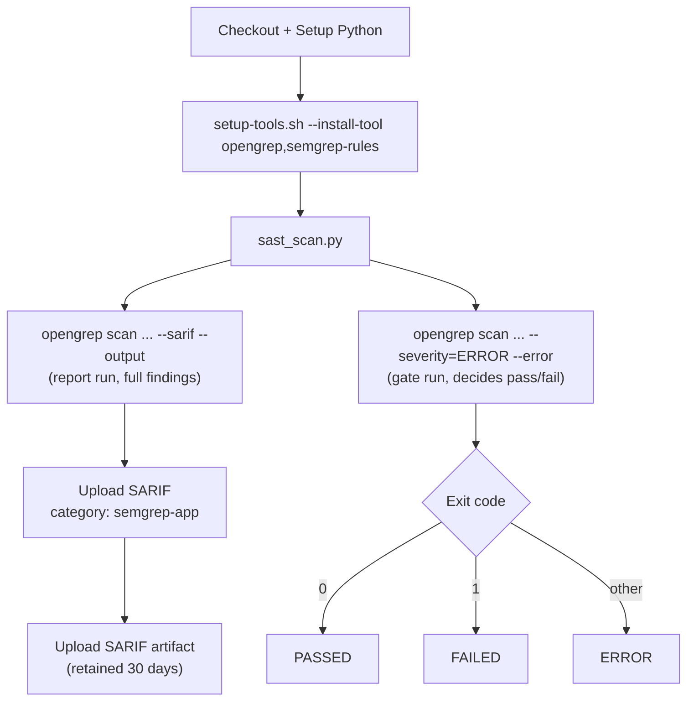

# Reference: SAST (Static Application Security Testing) Pipeline

| Property | Value |
|---|---|
| Workflow file | `sast.yml` |
| Orchestrator | `ci/sast_scan.py` |
| Triggers | `pull_request`, `workflow_dispatch`, weekly schedule |
| Scans | Application source code only, not the Dockerfile, not dependencies |
| Tool | OpenGrep |
| Gate model | Rule-severity gate (see [gate-status-rule-severity.md](gate-status-rule-severity.md)) |


## Execution order

`run_opengrep()` runs the scanner **twice**, with the same base command
and different flags each time:



Run 1 always writes the complete SARIF report, regardless of severity, so
every finding is visible in the GitHub Security tab. Run 2 is the actual
gate: it only considers `ERROR`-severity findings and exits non-zero if
any are present. This split exists so that lower-severity findings are
still recorded and visible, without being able to block the build.

## Environment variables

| Variable | Purpose |
|---|---|
| `SEMGREP_CONFIG_RULESETS` | Space-separated list of OpenGrep/Semgrep rule packs to run, differs per repository (see below) |
| `OPENGREP_EXCLUDE` | Space-separated glob patterns excluded from the scan |
| `OPENGREP_SARIF_OUTPUT` | Output path for the SARIF report |

### Ruleset configuration by repository

| Repository | `SEMGREP_CONFIG_RULESETS` |
|---|---|
| `platform-backend` (Java) | `semgrep-rules/generic semgrep-rules/problem-based-packs semgrep-rules/bash semgrep-rules/java auto semgrep-rules/yaml semgrep-rules/package_managers p/default` |
| `platform-ui` (Angular/npm) | `semgrep-rules/generic semgrep-rules/problem-based-packs semgrep-rules/bash semgrep-rules/javascript semgrep-rules/yaml semgrep-rules/package_managers p/default semgrep-rules/json` |

### Exclude patterns by repository

| Repository | `OPENGREP_EXCLUDE` |
|---|---|
| `platform-backend` | `*.sarif ci/ Dockerfile* .pre-commit-config.yaml docs/** README.md AGENTS.md` |
| `platform-ui` | `*.sarif ci/ Dockerfile* dist/** build/** node_modules/** .angular/**` |

## Running it locally

```bash
bash ci/setup-tools.sh --install-tool opengrep,semgrep-rules
python ci/sast_scan.py
```

## Exit code to status mapping

| `opengrep` gate-run exit code | Orchestrator status |
|---|---|
| `0` | `PASSED` |
| `1` | `FAILED` (error-severity findings present) |
| anything else | `ERROR` (tool did not run correctly) |

If the expected SARIF output file doesn't exist after the run, the status
is forced to `ERROR` regardless of exit code, a missing report means the
tool didn't actually run, not that it found nothing.

See also: [why-opengrep-not-semgrep.md](../explanation/why-opengrep-not-semgrep.md).