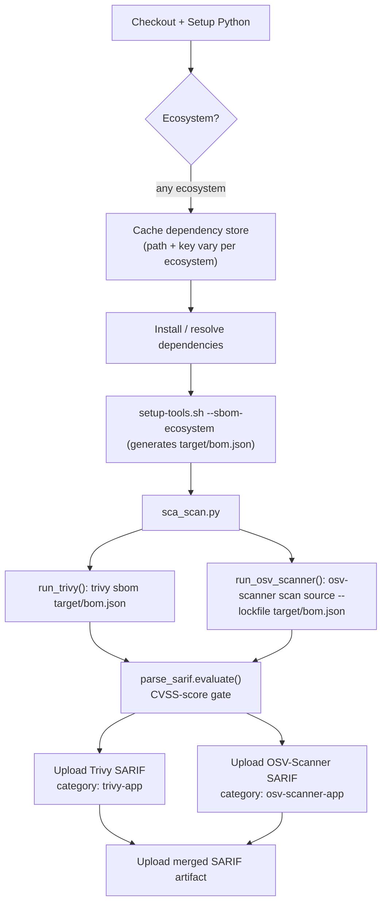

# Reference: SCA (Software Composition Analysis) Pipeline

| Property | Value |
|---|---|
| Workflow file | `sca.yml` |
| Orchestrator | `ci/sca_scan.py` |
| Triggers | `pull_request`, `workflow_dispatch`, weekly schedule |
| Scans | Application dependencies, via a generated SBOM, not the source code and not a container image |
| Tools | Trivy, OSV-Scanner |
| Gate model | CVSS-score gate (see [gate-status-cvss.md](gate-status-cvss.md)) |
| Supported ecosystems | Maven, Gradle, npm, raw JavaScript, Python, Go, see [integrate-a-new-ecosystem.md](../how-to/integrate-a-new-ecosystem.md) |

## Execution order



`sca_scan.py` itself has no ecosystem awareness at all, it only reads
`SBOM_PATH`. Everything upstream of that (dependency install, SBOM
generation) is what varies per ecosystem.

## Environment variables

| Variable | Default | Purpose |
|---|---|---|
| `SBOM_PATH` | `target/bom.json` | Path to the generated SBOM that both tools scan |
| `TRIVY_IGNOREFILE` | `ci/suppress_trivy.yaml` | Trivy suppression file |
| `OSV_IGNOREFILE` | `ci/suppress_osv_scanner.toml` | OSV-Scanner suppression file |
| `TRIVY_SARIF_OUTPUT` | `trivy-<service>.sarif` | Trivy SBOM scan output |
| `OSV_SARIF_OUTPUT` | `osv-scanner-<service>.sarif` | OSV-Scanner SBOM scan output |
| `SCA_MERGED_SARIF_OUTPUT` | `SCA-<service>-merged.sarif` | Combined artifact, not used for the gate decision itself |

## Commands run

```bash
# Trivy scans the SBOM directly
trivy sbom "$SBOM_PATH" --format sarif --ignorefile "$TRIVY_IGNOREFILE" --output "$TRIVY_SARIF_OUTPUT"

# OSV-Scanner scans the SBOM as its "lockfile" input
osv-scanner scan source --lockfile "$SBOM_PATH" --config "$OSV_IGNOREFILE" --format sarif --output-file "$OSV_SARIF_OUTPUT"
```

Note the OSV-Scanner orchestration detail: OSV-Scanner returns exit code
`1` whenever it finds any vulnerability at all, regardless of severity.
`run_osv_scanner()` treats that specific exit code as non-fatal and
remaps it to `0`, so the pipeline continues to the SARIF-based gate
evaluation instead of failing immediately on any finding. The actual
pass/fail decision comes from `parse_sarif.evaluate()` afterward, not from
OSV-Scanner's own exit code.

## Running it locally

Exact install/SBOM commands per ecosystem (Maven, Gradle, npm, raw
JavaScript, Python, Go) are in
[integrate-a-new-ecosystem.md](../how-to/integrate-a-new-ecosystem.md#ecosystem-matrix).
General shape:

```bash
<install/resolve dependencies for your ecosystem>
bash ci/setup-tools.sh --install-tool trivy,osv-scanner --sbom-ecosystem <ecosystem>
python ci/sca_scan.py
```

## Caching

Cache path and key are the one piece of the pipeline that must match the
dependency manager in use. See the
[ecosystem matrix](../how-to/integrate-a-new-ecosystem.md#ecosystem-matrix)
for the exact path/key pair per ecosystem. The general rule: the cache key
must be derived from the **lockfile** (`pom.xml`, `package-lock.json`,
`go.sum`, etc.), never from the manifest alone. Hashing the wrong file
could give two different resolved dependency trees the same cache key, a
correctness bug, not just a performance one, since the cached artifacts
would then be reused across builds that should have resolved different
versions.

See also: [why-sboms.md](../explanation/why-sboms.md),
[why-two-sca-tools.md](../explanation/why-two-sca-tools.md).
