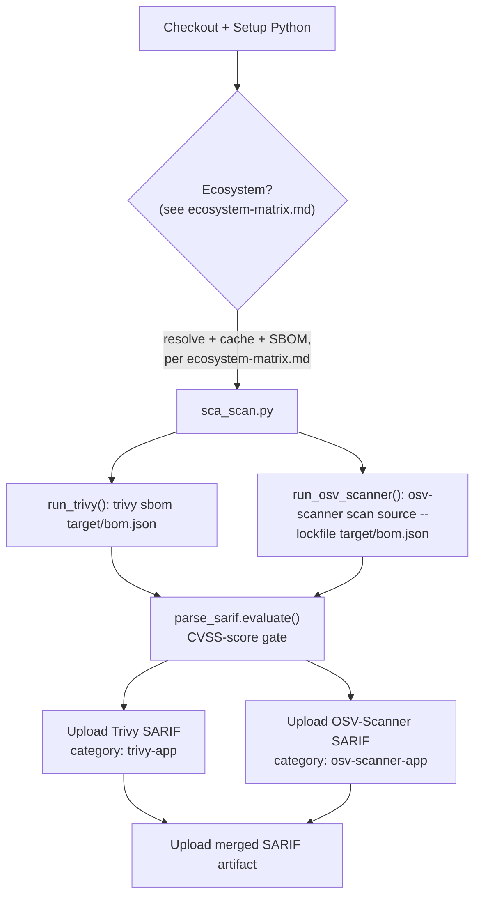

# Reference: SCA (Software Composition Analysis) Pipeline

| Property | Value |
|---|---|
| Workflow file | `sca.yml` |
| Orchestrator | `ci/sca_scan.py` |
| Triggers | `pull_request`, `workflow_dispatch`, weekly schedule |
| Scans | Application dependencies, via a generated SBOM, not the source code and not a container image |
| Tools | Trivy, OSV-Scanner |
| Gate model | CVSS-score gate (see [gate-status-cvss.md](gate-status-cvss.md)) |

Everything on this page, the orchestrator, the two tools, the gate, is
identical regardless of ecosystem. The only ecosystem-specific piece is the
"Ecosystem?" branch below, which resolves dependencies, caches the right
directory, and generates the SBOM differently per language. See
[ecosystem-matrix.md](ecosystem-matrix.md) for the full, current set of
supported ecosystems (Maven, npm shipped; Gradle, Python documented;
raw JavaScript has no SBOM path), that page is the single place this
branch is documented, not repeated here.

## Execution order



## Environment variables

| Variable | Default | Purpose |
|---|---|---|
| `SBOM_PATH` | `target/bom.json` | Path to the generated SBOM that both tools scan |
| `TRIVY_IGNOREFILE` | `ci/suppress_trivy.yaml` | Trivy suppression file |
| `OSV_IGNOREFILE` | `ci/suppress_osv_scanner.toml` | OSV-Scanner suppression file |
| `TRIVY_SARIF_OUTPUT` | `trivy-<service>.sarif` | Trivy SBOM scan output |
| `OSV_SARIF_OUTPUT` | `osv-scanner-<service>.sarif` | OSV-Scanner SBOM scan output |
| `SCA_MERGED_SARIF_OUTPUT` | `SCA-<service>-merged.sarif` | Combined artifact, not used for the gate decision itself |

## Commands run

```bash
# Trivy scans the SBOM directly
trivy sbom "$SBOM_PATH" --format sarif --ignorefile "$TRIVY_IGNOREFILE" --output "$TRIVY_SARIF_OUTPUT"

# OSV-Scanner scans the SBOM as its "lockfile" input
osv-scanner scan source --lockfile "$SBOM_PATH" --config "$OSV_IGNOREFILE" --format sarif --output-file "$OSV_SARIF_OUTPUT"
```

Both commands are the same regardless of ecosystem, they operate on
`target/bom.json`, whatever generated it. Note the OSV-Scanner
orchestration detail: OSV-Scanner returns exit code `1` whenever it finds
any vulnerability at all, regardless of severity. `run_osv_scanner()`
treats that specific exit code as non-fatal and remaps it to `0`, so the
pipeline continues to the SARIF-based gate evaluation instead of failing
immediately on any finding. The actual pass/fail decision comes from
`parse_sarif.evaluate()` afterward, not from OSV-Scanner's own exit code.

## Running it locally

Look up your ecosystem's resolve and SBOM-generation commands in
[ecosystem-matrix.md](ecosystem-matrix.md), then run:

```bash
<resolve-dependencies-command>                                                     # from the matrix
bash ci/setup-tools.sh --install-tool trivy,osv-scanner --sbom-ecosystem <value>   # <value> from the matrix
python ci/sca_scan.py
```

For example, for the two shipped ecosystems:

```bash
# Maven
mvn dependency:resolve -q
bash ci/setup-tools.sh --install-tool trivy,osv-scanner --sbom-ecosystem maven
python ci/sca_scan.py

# npm
npm ci
bash ci/setup-tools.sh --install-tool trivy,osv-scanner --sbom-ecosystem npm
python ci/sca_scan.py
```

## Caching

Cache paths and keys are ecosystem-specific and documented per-ecosystem in
[ecosystem-matrix.md](ecosystem-matrix.md), not repeated here. The one
correctness rule that applies across every ecosystem: **the cache key must
be derived from the lockfile, not the manifest** (`package-lock.json`, not
`package.json`; `poetry.lock`, not `pyproject.toml` alone). Hashing the
wrong file can give two different resolved dependency trees the same cache
key, a correctness bug, not just a performance one, since the cached
artifacts would then be reused across builds that should have installed
different versions.

See also: [why-sboms.md](../explanation/why-sboms.md),
[why-two-sca-tools.md](../explanation/why-two-sca-tools.md),
[ecosystem-matrix.md](ecosystem-matrix.md).
